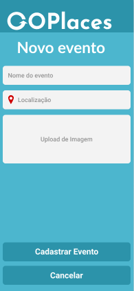

# GoPlaces
Aplicativo que busca eventos próximos através de localização, conectando pessoas e estabelecimento, e com informações sobre
promoções e brindes. O aplicativo foi completamente desenvolvido utilizando React Native.

Tela inicial                                                  | Busca de Eventos            |  Novo Evento
:------------------------------------------------------------:|:-------------------------:|:-------------------------:
      |   | 

## Instalação
Ao clonar o repositório você deve entrar na pasta do projeto e executar o seguinte comando:
> yarn install

## Execução
Para executar o projeto é necessário que o seguinte comando seja executado:
> expo start

Então, uma página com um QR Code se abrirá e você deve escanear o QR Code através do aplicativo Expo.
Assim o aplicativo será iniciado.
